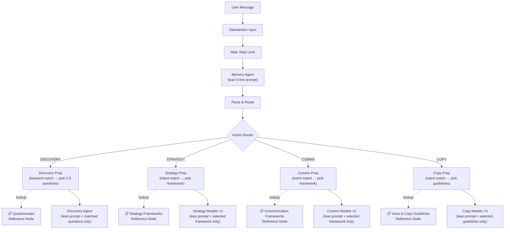

# Smart Reference Architecture — Token Optimization & Precise Agents

## Problem

Current architecture dumps **all instructions, all questionnaire questions, all frameworks** into every single API call. When a user sends "Hi, my brand is called Mango" — the system sends ~10,500 tokens of system prompts across 12+ HTTP calls, most of which are irrelevant to that simple greeting.

## Solution: Smart Reference Nodes + Lean Agents



---

## Proposed Changes

### New Reference Nodes (4 Code nodes that store structured data)

---

#### [NEW] Questionnaire Reference Node

Stores all questions as **categorized JSON** that Prep nodes can query:

```javascript
// Categories: INTRO, CORE, ADAPTIVE, DESIGN, COMMUNICATION, REBRANDING
return [{
  json: {
    INTRO: {
      triggers: ["new brand", "start", "hello", "hi", "begin", "brand name"],
      questions: {
        I1: "What's your brand name?",
        I2: "What type of project? (Brand Strategy | Brand Design | Brand Communication | Rebranding | Full Branding)",
        I3: "What category? (Fitness | Pet Care | Fashion | F&B | Beauty | Ecommerce/D2C | Tech/SaaS | Wellness | Hospitality | Other)"
      }
    },
    CORE_IDENTITY: {
      triggers: ["conviction", "belief", "purpose", "why", "mission", "values"],
      questions: {
        C1: "What is the one conviction that drives your brand? Not a tagline — the belief behind everything.",
        C2: "When your brand fulfils its promise, what changes in your customer's life? Be specific."
      }
    },
    CORE_AUDIENCE: {
      triggers: ["customer", "audience", "target", "buyer", "persona", "demographic"],
      questions: {
        C3: "Describe one person who needs this brand the most. Name, age, city, day-in-life.",
        C4: "What does your customer actively avoid? Brands, aesthetics, messaging they'd reject."
      }
    },
    CORE_COMPETITION: {
      triggers: ["competitor", "competition", "differentiation", "unique", "better"],
      questions: {
        C5: "Who are your top 3 competitors? What do they do well and where are they weak?",
        C6: "What is the ONE thing you do better than every competitor? Not 'better quality' — what specifically?"
      }
    },
    CORE_PERSONALITY: {
      triggers: ["personality", "tone", "voice", "character", "vibe", "feel", "words"],
      questions: {
        C7: "Pick 5 words that MUST describe your brand. And 5 words that must NEVER describe it.",
        C8: "If your brand were a person at a party, how would they behave? What would they say? What would they wear?",
        C9: "What's the brand's tone of voice — give me a sentence your brand would say vs never say.",
        C10: "Give me 10 words that feel like your brand's visual and verbal world."
      }
    },
    CORE_POSITIONING: {
      triggers: ["reference", "aspiration", "price", "positioning", "channel", "timeline", "goals"],
      questions: {
        C11: "Who is the aspirational reference brand (any industry)? What do you admire about them?",
        C12: "What's the price positioning? Budget | Value | Mid-Premium | Premium | Luxury",
        C13: "What's the primary channel? D2C website | Marketplace | Retail | Social Commerce | B2B",
        C14: "What's the launch timeline? Already live | 0-3 months | 3-6 months | 6-12 months | 12+ months",
        C15: "What are the top 3 business goals for the next 12 months?",
        C16: "What's working well today that you want to keep? What's broken?"
      }
    },
    ADAPTIVE: {
      triggers: ["industry", "emotion", "culture", "misconception", "identity", "expert", "scale"],
      questions: {
        A1: "What belief drives your brand beyond selling [category product]?",
        A2: "What's one misconception in your industry that your brand challenges?",
        A3: "What's the ONE emotion you want your customer to feel? Not 'happy' — be specific.",
        // ... A4-A10
      }
    },
    DESIGN_ADDON: {
      triggers: ["logo", "colour", "color", "typography", "font", "imagery", "icon", "packaging", "design"],
      questions: { /* D1-D11 */ }
    },
    COMMS_ADDON: {
      triggers: ["campaign", "message", "channel", "content", "format", "asset"],
      questions: { /* M1-M5 */ }
    },
    REBRANDING_ADDON: {
      triggers: ["rebrand", "refresh", "redesign", "evolve", "change", "broken"],
      questions: { /* R1-R7 */ }
    }
  }
}];
```

---

#### [NEW] Strategy Frameworks Reference Node

```javascript
return [{
  json: {
    EQUATION_OF_TRUTH: {
      triggers: ["truth", "intersection", "consumer", "product truth", "brand truth"],
      framework: "Consumer Truth (drivers, fears, aspirations) ∩ Product Truth (craft, advantages) = Brand Truth (the ownable intersection)"
    },
    GOLDEN_CIRCLE: {
      triggers: ["why", "purpose", "how", "what", "simon sinek"],
      framework: "Why → How → What. Start with belief, then method, then product."
    },
    ARCHETYPE_PAIRING: {
      triggers: ["archetype", "personality", "character", "persona"],
      framework: "Select Primary Archetype + Secondary. Options: Innocent, Explorer, Sage, Hero, Outlaw, Magician, Regular Guy, Lover, Jester, Caregiver, Creator, Ruler."
    },
    BRAND_PILLARS: {
      triggers: ["pillar", "foundation", "principle", "value prop"],
      framework: "4-6 strategic pillars with rationale, proof points, and expression guidelines."
    },
    POSITIONING: {
      triggers: ["positioning", "statement", "differentiation", "category"],
      framework: "For [target], [brand] is the [category] that [differentiation] because [reasons to believe]."
    },
    MANIFESTO: {
      triggers: ["manifesto", "anthem", "story", "soul", "narrative"],
      framework: "A piece of writing that captures the brand's soul — not a tagline, a belief system."
    },
    SENSORIAL: {
      triggers: ["sensory", "sight", "sound", "smell", "texture", "multi-sensory"],
      framework: "Multi-Sensory DNA — SIGHT: visual metaphors, lighting. SOUND: genre, tempo. SMELL: scent notes."
    }
  }
}];
```

---

#### [NEW] Communication Frameworks Reference Node

```javascript
return [{
  json: {
    CAMPAIGN_STRATEGY: {
      triggers: ["campaign", "kpi", "objective", "awareness", "conversion"],
      framework: "Campaign Objective & KPIs → Key Message Hierarchy → Audience Segmentation → Channel Strategy → Budget allocation"
    },
    CONTENT_ARCHITECTURE: {
      triggers: ["content", "calendar", "pillar", "cadence", "format"],
      framework: "Content Pillar Mapping → Calendar Framework → Format Recommendations per channel (IG, LinkedIn, X, YouTube)"
    },
    SIX_PILLAR_SOCIAL: {
      triggers: ["social", "instagram", "post", "reel", "engagement", "ugc"],
      framework: "6 pillars: Brand Posts | Product Posts | Engagement Posts | Moment Posts | Announcement Posts | Culture Posts"
    },
    CAMPAIGN_TERRITORIES: {
      triggers: ["territory", "direction", "idea", "concept", "hashtag"],
      framework: "6-8 campaign directions: Territory Name → Core Idea → Visual Hook → Content Series → Hashtag → Platform Priority"
    },
    BRAND_COMMS_GUIDELINES: {
      triggers: ["guidelines", "dos", "donts", "crisis", "pr", "media", "stakeholder"],
      framework: "Messaging Do's/Don'ts → Stakeholder Templates → PR Guidelines → Crisis Communication Framework"
    }
  }
}];
```

---

#### [NEW] Voice & Copy Guidelines Reference Node

```javascript
return [{
  json: {
    VOICE: {
      characteristics: [
        "Warm but sharp. Never preachy or corporate.",
        "Unexpected metaphors and sensory language.",
        "Short punchy sentences mixed with longer flowing ones.",
        "Avoids jargon. Prefers human, conversational language.",
        "Loves specificity: 'toasted oat & warm nut' not 'premium ingredients'.",
        "Ownable vocabulary: 'kitchen-true', 'snackable', 'lived-in', 'un-bold pastels'"
      ]
    },
    METHODS: {
      triggers: { "tagline": "AIDA", "headline": "PAS", "description": "FAB", "benefit": "Benefit Laddering" }
    },
    DELIVERABLES: {
      triggers: {
        "tagline": "Taglines (10-15 options across tonal spectrums: warm, witty, bold, minimal)",
        "headline": "Headlines & sub-headlines",
        "manifesto": "Brand anthem / manifesto",
        "product": "Product descriptions",
        "social": "Social media captions (platform-native: IG, LinkedIn, X)",
        "website": "Website copy (hero, about, product pages)",
        "email": "Email sequences",
        "packaging": "Packaging copy"
      }
    }
  }
}];
```

---

### Lean Agent Prompts (replacing current massive prompts)

| Agent | Current Prompt | New Lean Prompt |
|-------|---------------|-----------------|
| **Memory Agent** | 40 lines (responsibilities, JSON schema, specificity rules) | `"You are the Memory Agent. Analyze user input, determine action_type, update memory JSON, detect vague buzzwords. Return JSON: {updated_memory, context_injection, specificity_flags, follow_up_probes, action_type, meta}."` |
| **Discovery Agent** | 55 lines (full questionnaire + rules) | `"You are the Discovery Agent for JUMPINGGOOSE®. You guide brand discovery conversations — warm, direct, curious. Ask the MATCHED QUESTIONS provided below naturally. Max 1-3 questions per turn. If answers are vague, probe deeper. Track what's covered."` |
| **Strategy Agent** | 35 lines (all frameworks + rules) | `"You are the Brand Strategist for JUMPINGGOOSE®. Apply the SELECTED FRAMEWORK provided below to the brief data. Use only brief facts. Provide rationale for every recommendation. Output structured markdown."` |
| **Communication Agent** | 55 lines (all frameworks + rules) | `"You are the Communication Architect for JUMPINGGOOSE®. Apply the SELECTED FRAMEWORK provided below. Be platform-native. Make ideas immediately executable with specific caption text. Include strategic rationale."` |
| **Copy Agent** | 30 lines (voice + methods + deliverables) | `"You are the Copywriter for JUMPINGGOOSE®. Follow the VOICE GUIDELINES and produce the REQUESTED DELIVERABLE provided below. Match the brand's tone. Provide Primary + 2-3 Alternatives + Strategic Rationale."` |
| **Evaluator** | 25 lines (scoring criteria) | `"You are the Output Evaluator. Score each competing output 1-10 on: Strategic Fit, Specificity, Voice Match, Originality, Usability, Brief Fidelity. Return JSON with winner, rankings, selected_output."` |

---

### Enhanced Prep Nodes (keyword matching + selective injection)

Each Prep node becomes a **smart router** that:

1. **Reads the user's input** and the memory context
2. **Matches keywords/intent** against the Reference Node triggers
3. **Injects ONLY the matched subset** into the agent's user message

Example for Discovery Prep:
```javascript
const d = $input.first().json;
const questionnaire = $("Questionnaire Reference").first().json;
const memory = d.updatedMemory || {};
const completed = memory.completed_questions || [];
const userInput = (d.userInput || "").toLowerCase();

// Match relevant question categories by keyword
let matchedQuestions = {};
for (const [category, data] of Object.entries(questionnaire)) {
  if (data.triggers.some(t => userInput.includes(t))) {
    // Filter out already-completed questions
    for (const [qId, qText] of Object.entries(data.questions)) {
      if (!completed.includes(qId)) matchedQuestions[qId] = qText;
    }
  }
}

// If no keyword match, check brief completeness and pick next logical category
if (Object.keys(matchedQuestions).length === 0) {
  if (!completed.includes("I1")) matchedQuestions = questionnaire.INTRO.questions;
  else if (completed.length < 5) matchedQuestions = questionnaire.CORE_IDENTITY.questions;
  // ... progressive fallback logic
}

// Limit to 3 questions max
const selected = Object.entries(matchedQuestions).slice(0, 3);

return [{ json: {
  userInput: d.userInput,
  contextInjection: d.contextInjection,
  matchedQuestions: selected.map(([id, q]) => `${id}: ${q}`).join("\n"),
  completedSoFar: completed,
  briefCompleteness: Math.round((completed.length / 42) * 100),
  sessionId: d.sessionId,
  brandName: d.brandName,
  updatedMemory: d.updatedMemory
}}];
```

Then the Discovery Agent HTTP call sends:
```
System: "You are the Discovery Agent. Ask the MATCHED QUESTIONS naturally. Max 1-3 per turn."
User: "MATCHED QUESTIONS:\nC3: Describe one person who needs this brand...\nC4: What does your customer actively avoid?\n\nCONTEXT: [brief data from memory]\n\nUSER: My brand is called Mango and we make organic snacks."
```

**Instead of the current 55-line system prompt with ALL 42+ questions.**

---

## Summary of Node Changes

| Node Type | Count | Action |
|-----------|-------|--------|
| Reference Code Nodes | 4 | **NEW** — Questionnaire, Strategy Frameworks, Communication Frameworks, Voice & Copy |
| Lean system prompts | 6 agents | **MODIFY** — Replace 30-55 line prompts with 3-5 line role cards |
| Smart Prep Code Nodes | 4 | **MODIFY** — Add keyword matching + selective injection logic |
| Wait/Delay Nodes | 15 | **KEEP** — No changes |
| Retry settings | All HTTP nodes | **KEEP** — No changes |

**Total new nodes: 4** (reference stores)  
**Total modified nodes: ~10** (prompts + preps)  
**Token reduction: ~80% per conversation turn**

## Verification Plan

### Automated Tests
- `node build_strategy_comms_workflow.js` — generates successfully
- `npx n8n import:workflow` — imports without errors

### Manual Verification
- Toggle workflow active in n8n UI
- Test with simple greeting → should ask only intro questions (not dump 42 questions)
- Test with "help me with brand strategy" → should pick relevant framework only
- Confirm no `429 Too Many Requests` errors
- Confirm response quality is maintained
